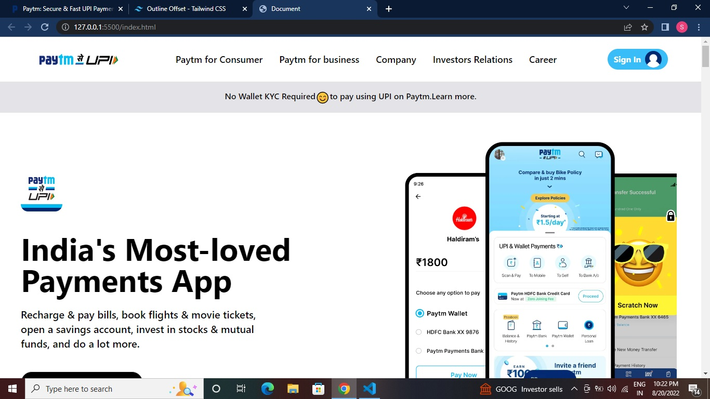

# Paytm Clone Using HTML + Tailwind CSSS

## Time

It tooked me around 16 hours.

## Learned

- Tailwind CSS.
- How to read documentation and implement.
- Different tailwind css concepts.
- How to make responsive using tailwind CSS.

## Screen Shoot

## Live Link

[Netlify](https://soumyadeep-paytm-clone.netlify.app/)
